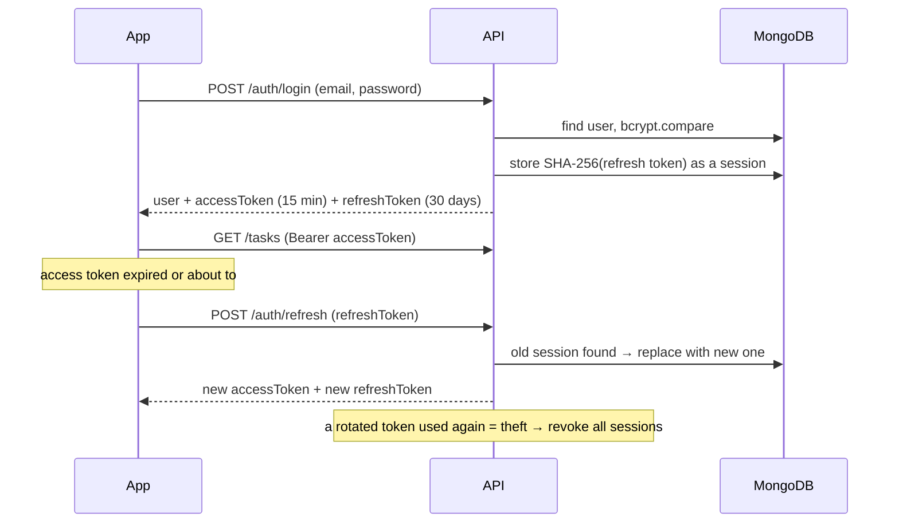

# DoAll

**A to-do app with opinions about what you should do next.**

DoAll is an Android app built with the React Native CLI and TypeScript, backed by a NestJS + MongoDB REST API. You sign up, add tasks with a schedule, deadline and priority, and DoAll's *smart sort* weighs all three to put the right task on top — then tells you why.


<p align="center"><sub>Welcome · Today · Task detail · New task · Dark mode</sub></p>

<details>
<summary><b>More screens</b></summary>


<p align="center"><sub>Log in (with server error) · Sign up · Sort &amp; filter · Profile &amp; stats · Dark detail</sub></p>
</details>

---

## Contents

- [Features](#features)
- [Tech stack](#tech-stack)
- [Repository layout](#repository-layout)
- [Getting started](#getting-started)
- [How it works](#how-it-works)
  - [Smart sort](#smart-sort)
  - [Authentication flow](#authentication-flow)
  - [State management](#state-management)
  - [Design language](#design-language)
- [API reference](#api-reference)
- [Testing](#testing)
- [Notes & trade-offs](#notes--trade-offs)

---

## Features

### Core (from the brief)

| | |
|---|---|
| **Register / log in** | Email + password accounts. Inline validation that mirrors the server rules, password strength meter, friendly server errors. |
| **Add tasks** | Title, description, **date-time** (when you'll do it), **deadline**, **priority** — plus category and tags. One-tap presets (*Tonight*, *Tomorrow*, *In 3 days*…) or the native Android date & time pickers. |
| **Complete tasks** | Tick the checkbox, **swipe right**, or use the detail screen. Every completion can be undone. |
| **Delete tasks** | **Swipe left** (with an *Undo* toast) or delete from the detail screen (with confirmation). |
| **See status at a glance** | Open / overdue / done, live "Due in 3h" / "2d late" countdowns, a red shadow on overdue cards, and today's progress ring. |
| **Backend** | NestJS REST API with MongoDB (Mongoose) for users and tasks. |

### Bonus

- **Smart sort** — blends priority, deadline pressure and schedule into one score ([formula below](#smart-sort)). The top task gets an **Up next** badge, and each task's detail screen shows a **"Why it's ranked here"** bar that breaks its score down.
- **Four more sort orders** — deadline, scheduled time, priority, newest.
- **Filtering & search** — quick views (*All, Today, Upcoming, Overdue, Done*) with live counts, priority and category filters, and search across titles, notes and `#tags`.
- **Categories & tags** — six colour-coded categories plus up to five free-form tags per task.
- **Dashboard** — today's progress ring, overdue count and the recommended next task on the home screen; totals, completion rate and an open-tasks-by-category chart on the profile screen.
- **Light, dark & system themes**, persisted on the device.
- **Feels fast** — optimistic updates with automatic rollback, skeleton loaders, pull-to-refresh, animated cards and a haptic tick when you finish something.
- **Hardened auth** — short-lived access tokens, rotating refresh tokens with reuse detection, rate limiting on credential endpoints, and a session that survives app restarts.
- **Housekeeping** — bulk "clear completed", discard-changes guard on the editor, Swagger docs for the API.

---

## Tech stack

| Layer | Choice |
|---|---|
| Mobile | React Native **0.87** (CLI, New Architecture) · TypeScript · React 19 |
| Navigation | React Navigation 7 (native stack) |
| State | **Redux Toolkit** (slices, entity adapter, memoised selectors, listener middleware) + React Redux |
| Networking | Axios with auth / refresh interceptors |
| UI | Hand-built design system on `react-native-svg`; Bricolage Grotesque, IBM Plex Mono and Instrument Serif fonts |
| Storage | AsyncStorage (session + preferences) |
| Backend | **NestJS 11** · Mongoose 8 / **MongoDB 7** · JWT · bcrypt · class-validator · Helmet · Throttler · Swagger |
| Tests | Jest (+ ts-jest, Supertest, react-test-renderer) |
| Tooling | ESLint, Prettier, Docker Compose |

---

## Repository layout

```
.
├── backend/                     NestJS API
│   ├── src/
│   │   ├── auth/                register · login · refresh · logout · me
│   │   ├── users/               user schema + data access
│   │   ├── tasks/               CRUD, filters, stats, smart ordering
│   │   ├── common/              global JWT guard, decorators, pipes, utils
│   │   ├── config/              typed config + env validation
│   │   ├── health/              liveness endpoint
│   │   ├── app.module.ts        wiring (Mongo, guards, throttling)
│   │   └── main.ts              bootstrap + Swagger
│   ├── test/                    end-to-end tests (real MongoDB)
│   └── Dockerfile
├── mobile/                      React Native app (Android)
│   ├── android/                 native project (fonts, icon, splash, theme)
│   └── src/
│       ├── api/                 axios client, endpoints, error mapping
│       ├── features/
│       │   ├── auth/            auth slice + form validation
│       │   ├── tasks/           tasks slice, selectors, smart ordering, types
│       │   └── preferences/     theme + sort preferences
│       ├── components/
│       │   ├── ui/              design system (BrutalBox, Button, TextField, Sheet, Toast…)
│       │   └── tasks/           TaskCard, SwipeableRow, StatsHero, FilterSheet…
│       ├── screens/             Welcome, Login, Register, Home, TaskDetail, TaskEditor, Profile
│       ├── navigation/          auth-gated stacks
│       ├── services/            session + storage
│       ├── theme/               palette, typography, light/dark themes
│       └── store/               store setup + typed hooks
├── docs/                        screenshots
└── docker-compose.yml           MongoDB + API in one command
```

---

## Getting started

### Prerequisites

- **Node.js 22.11+** and npm
- **Android development setup** for React Native — Android Studio with SDK Platform 36, an emulator or a USB-debugging device, and JDK 17+ ([official guide](https://reactnative.dev/docs/set-up-your-environment))
- **Docker** (easiest way to run MongoDB) *or* a local MongoDB 6+

### 1. Start the backend

**Option A — Docker (MongoDB + API):**

```bash
docker compose up -d --build
curl http://localhost:3000/api/health      # {"status":"ok","db":"up",...}
```

**Option B — Node directly:**

```bash
docker compose up -d mongo                 # or use your own MongoDB
cd backend
cp .env.example .env                       # then set two long random JWT secrets
npm install
npm run start:dev
```

Swagger docs are served at **http://localhost:3000/api/docs**.

### 2. Run the app

```bash
cd mobile
npm install
npm start                                  # Metro bundler
npm run android                            # in a second terminal
```

The app reaches the API at `http://10.0.2.2:3000/api`, which is how the **Android emulator** sees your computer's `localhost`. For a **physical device**, either:

- run `npm run adb:reverse` and set `DEV_HOST` to `'localhost'` in [`mobile/src/config.ts`](mobile/src/config.ts), or
- set `DEV_HOST` to your computer's LAN IP (phone and computer on the same Wi-Fi).

---

## How it works

### Smart sort

Every open task gets a score from three signals, each normalised to 0–1, and the list is ordered by it:

```
score = 0.40 · Priority  +  0.45 · DeadlinePressure  +  0.15 · Schedule
```

| Signal | Value |
|---|---|
| **Priority** | low `0.2` · medium `0.55` · high `1.0` |
| **Deadline pressure** | `e^(−hoursLeft / 36)` — ≈1.0 when due now, 0.51 a day out, 0.14 three days out, 0 with no deadline. **Overdue** tasks score `1 + up to 0.5`, growing over 48 h, so late work rises and keeps rising. |
| **Schedule** | Before the planned start: `e^(−hoursUntil / 12)` (a task planned for the next hour is "on deck"). After it: `0.6 + 0.4 · e^(−hoursSince / 24)`, so started-but-unfinished work stays visible. |

Deadline pressure carries the most weight because missing a deadline is the costliest outcome. Priority is strong but not absolute: a *low* priority task due in two hours outranks a *high* priority task due next week. Ties are broken by earliest deadline, then earliest schedule, then newest. Completed tasks always sink to the bottom, most recently finished first.

The algorithm lives in [`backend/src/tasks/task-ordering.ts`](backend/src/tasks/task-ordering.ts) (used by `GET /tasks?sort=smart`) and is mirrored on the device in [`mobile/src/features/tasks/ordering.ts`](mobile/src/features/tasks/ordering.ts), so the list re-sorts instantly without a network round-trip. Both copies are covered by the same test scenarios.

### Authentication flow



- **Passwords** are hashed with bcrypt. **Refresh tokens** are stored only as SHA-256 hashes (bcrypt silently truncates at 72 bytes, which JWTs exceed).
- **Rotation + reuse detection:** every refresh invalidates the old token. If an already-used token shows up again, every session for that user is revoked.
- **Up to 5 devices** stay signed in at once; logout revokes just that device's session.
- **On the device**, an Axios interceptor adds the access token, refreshes it ~30 s before it expires, and on a `401` refreshes **once** (concurrent requests share the same in-flight refresh) and replays the request. If the refresh token is rejected, the user is returned to the login screen with a "session expired" notice.
- Credential endpoints are **rate limited** (10 requests/min/IP); every task query is scoped to the caller, and another user's task id returns `404`, not `403`, so ids can't be probed.

### State management

Redux Toolkit holds the app state in three slices:

| Slice | Holds | Notes |
|---|---|---|
| `auth` | status (`restoring` / `signedOut` / `signedIn`), user, submit state, notices | Navigation is derived from `status`, so logged-out users can't navigate back into the app. |
| `tasks` | tasks normalised with `createEntityAdapter`, load status, active filters | Completing and deleting are **optimistic** and roll back on failure. Cleared on logout or session expiry. |
| `preferences` | theme mode, sort order | Saved to storage by listener middleware. |

The list itself comes from **memoised selectors** (`selectVisibleTasks`, `selectViewCounts`, `selectDashboard`) that combine filters, sort order and the current minute. Tokens deliberately live **outside** Redux in a small `session` service: they're secrets rather than UI state, and nothing should re-render when they rotate. Short-lived UI state, like form fields and open sheets, stays in component state.

### Design language

"Paper & ink" with a neo-brutalist edge: warm paper backgrounds, near-black ink outlines, **hard un-blurred offset shadows**, and highlighter-coloured stickers for priorities and categories.

- **Type:** *Bricolage Grotesque* for UI and headings, *IBM Plex Mono* for metadata and labels, and an *Instrument Serif Italic* accent word in headlines ("Do it ***all.***").
- **Colour:** paper `#F2EDE4`, ink `#121212`, signal orange `#FF5A1F` as the accent, lime `#D7F75B` for progress and completion, plus butter, sky, lilac, mint and blush for categories.
- **Touch:** buttons and cards physically "press into" their shadow, checkboxes pop when ticked, cards slide in, and swipe actions grow as you drag.
- **Dark mode** flips to ink paper with cream outlines and orange shadows.
- Custom SVG icon set, adaptive launcher icon, and an Android 12+ splash screen that matches.

All colours and type sizes come from [`mobile/src/theme`](mobile/src/theme); components never hard-code theme colours.

---

## API reference

Base URL: `http://localhost:3000/api`. Every route except `auth/register`, `auth/login`, `auth/refresh`, `auth/logout` and `health` requires `Authorization: Bearer <accessToken>`.

| Method | Path | Description |
|---|---|---|
| `POST` | `/auth/register` | `{ name, email, password }` → `{ user, tokens }` |
| `POST` | `/auth/login` | `{ email, password }` → `{ user, tokens }` |
| `POST` | `/auth/refresh` | `{ refreshToken }` → new `{ user, tokens }` (old refresh token is revoked) |
| `POST` | `/auth/logout` | `{ refreshToken }` → `204` |
| `GET` | `/auth/me` | Current user |
| `GET` | `/tasks` | List. Query: `status` (`all`/`active`/`completed`/`overdue`), `priority`, `category`, `tag`, `search`, `from`, `to`, `sort` (`smart`/`deadline`/`scheduled`/`priority`/`created`) |
| `GET` | `/tasks/stats` | Counters; `tzOffset` (minutes, from `Date#getTimezoneOffset`) defines "today" |
| `GET` | `/tasks/:id` | One task |
| `POST` | `/tasks` | Create: `{ title, description?, scheduledAt?, deadline?, priority?, category?, tags? }` |
| `PATCH` | `/tasks/:id` | Partial update (any of the above, plus `completed`) |
| `PATCH` | `/tasks/:id/status` | `{ completed: boolean }` |
| `DELETE` | `/tasks/:id` | `204` |
| `DELETE` | `/tasks/completed` | Delete every completed task → `{ deleted }` |
| `GET` | `/health` | Liveness + database status |

`tokens` is `{ accessToken, refreshToken, expiresIn }`, where `expiresIn` is the access token's lifetime in seconds. Validation errors return `400` with a `message` array; unknown fields are rejected. A deadline earlier than the scheduled time is rejected.

---

## Testing

```bash
# backend
cd backend
npm test             # unit: smart ordering, auth service (rotation, reuse detection), env validation
npm run test:e2e     # end-to-end against a real MongoDB (docker compose up -d mongo)
npm run lint

# mobile
cd mobile
npm test             # ordering, selectors, slices, validation, dates, API client refresh logic, TaskCard
npm run typecheck
npm run lint
```

| Suite | Tests |
|---|---|
| Backend unit | 19 |
| Backend e2e | 13 — registration, duplicates, validation, login, protected routes, refresh rotation & reuse detection, logout, CRUD, filters, search, smart sort, ownership isolation, stats |
| Mobile | 38 |

---

## Notes & trade-offs

- **Token storage.** Tokens are kept in AsyncStorage, which is app-private storage, and `allowBackup` is off. For production I'd switch to Android Keystore-backed storage such as `react-native-keychain`. Only [`services/session.ts`](mobile/src/services/session.ts) would change.
- **Sorting on the device.** A personal task list is small, so the app fetches it once and filters and sorts locally for instant feedback. The API offers the same filters and sorts for other clients.
- **HTTP in development.** Debug builds talk to the local API over plain HTTP. Release builds block cleartext traffic, so a deployed API should use HTTPS.
- **Undo for delete** recreates the task with the same content and status (it gets a new id).
- **Platform.** The app targets Android, per the brief. The iOS folder is the untouched React Native template.
